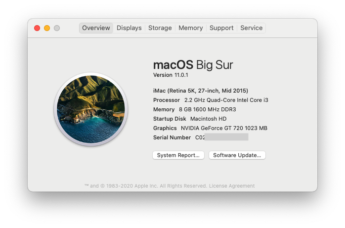

# Hackintosh Monterey Guide for ThinkCentre M92p Tower (OpenCore 0.7.4)
##### May be compatible with all ThinkCentre Edge 92, ThinkCentre M82, M92 and M92p, ThinkStation E31 systems.

### Hardware

Type|Item
:----|:----
**HDD** | SATA SSD
**GPU** | NVIDIA GT 720 1GB (Kepler core)
**WiFi + BT Combo** | BCM943602CS + PCIe Adaptor

### Current Driver Versions
Driver Name|Version
:----|:----
Lilu | 1.5.6
WhateverGreen | 1.5.4
AppleALC | 1.6.5
VirtualSMC | 1.2.7
IntelMausi | 1.0.7

## Instructions
### 1. BIOS Settings
* Enable UEFI boot and disable CSM mode
* Disable secure boot
* Enable VTx and disable VTd
### 2. Prepare installation media 
https://dortania.github.io/OpenCore-Install-Guide/extras/big-sur/  
https://dortania.github.io/OpenCore-Install-Guide/extras/monterey.html
### 3. Modify 'config.plist' for your own serial number, UUID, MLB, ROM, etc.
### 4. SMBIOS Choices:
- If you are using Intel HD4000 Graphics only: `MacPro6,1` for macOS Big Sur
- If you are using Intel HD4000 Graphics only: `Macmini6,1` or `iMac13,2` for macOS Catalina and below
- If you are using a Dedicated GPU: `iMacPro1,1` or even `MacPro6,1` for macOS Big Sur and above
- if you are using a Dedicated GPU: `iMac13,2` for macOS Catalina and below

### 5. Copy 'BOOT' and 'OC' directories to the EFI partition of the USB disk. (HDD UEFI dosen't boot for me)
### 6. For nVidia Kepler GPU, please refer to:
https://github.com/chris1111/Geforce-Kepler-patcher
### 7. Optional Settings
* Enable SSDT.aml for CPU PM according to your own CPU
[See the Guide](https://github.com/Piker-Alpha/ssdtPRGen.sh)
* Configure IGPU if you don't use dGPU (IGPU has not been supported in Monterey)

### Note
##### BIOS can't do UEFI boot from HDD. My solution is plugging an extra usb stick for booting.
##### This model doesn't support 4k video output even if installed a dGPU. No solution yet. 

